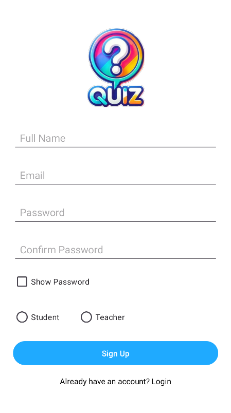
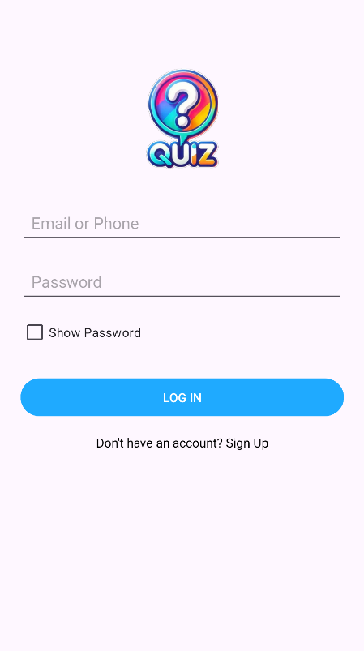
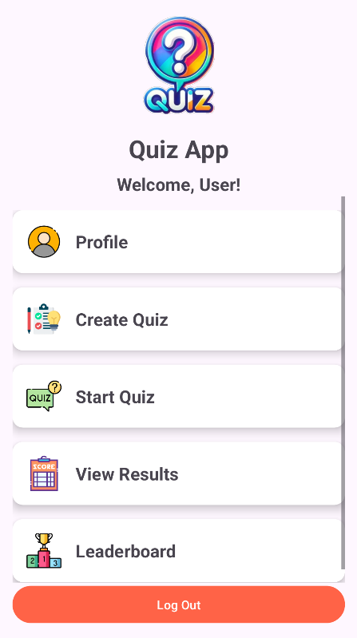
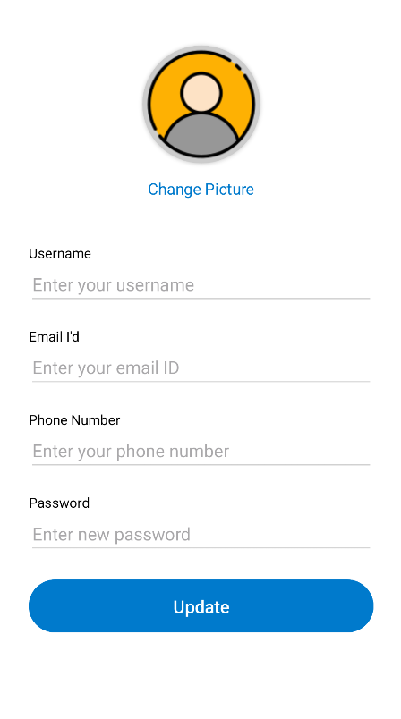
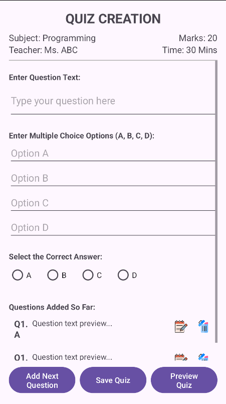
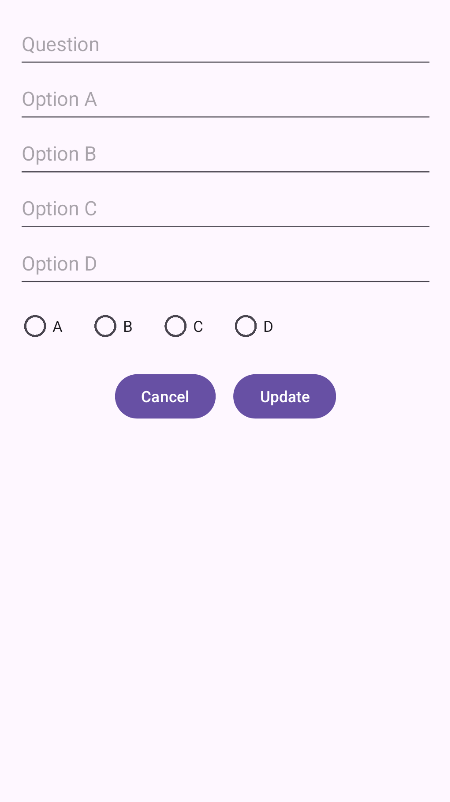
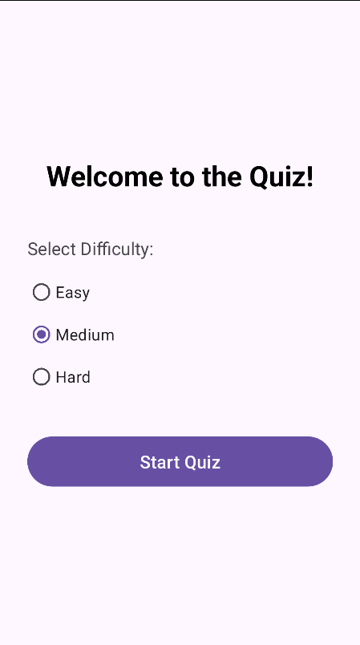
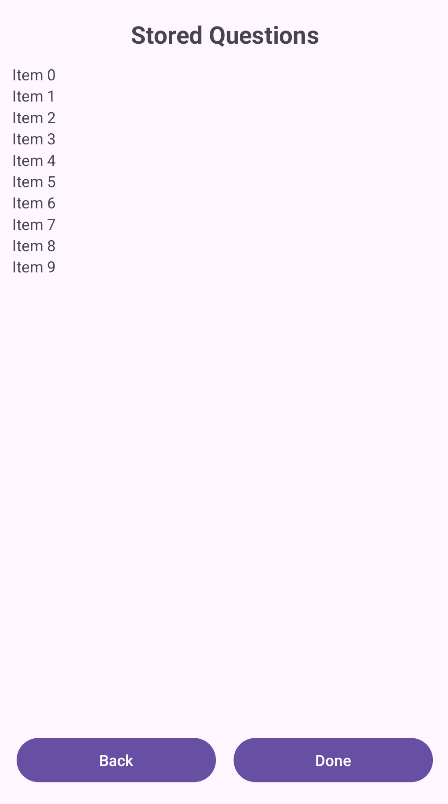
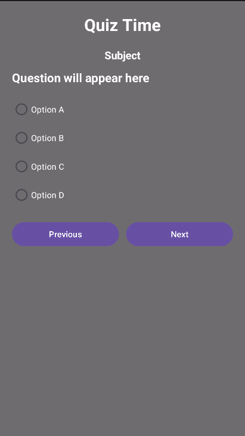
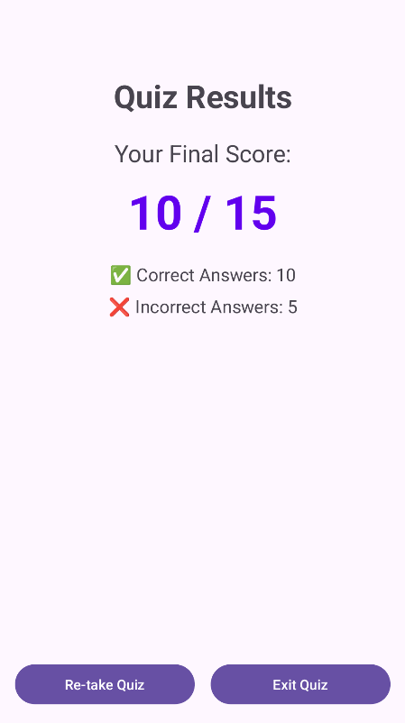

# Android Quiz App
An interactive quiz application developed using Android Studio.

## Features
- Multiple choice questions
- Score calculation
- User-friendly UI
- Instant result display

## Tech Stack
- Kotlin
- Android Studio
- XML
- SQLite

## Screenshort

### Splash Screen

### SignUp Screen

### Login Screen

### Dashboard Screen

### Profile Screen

### Create Quiz Screen

### Quention Adapter Screen

### Question Item Screen

### Edit Question Dialog Screen

### Preview Quiz Screen

### View Quention Screen

### Attempt Quiz Screen

### Result Screen

## How to Run
1. Clone the repository
2. Open in Android Studio
3. Click Run ▶

## Developer
Fatima Habib
